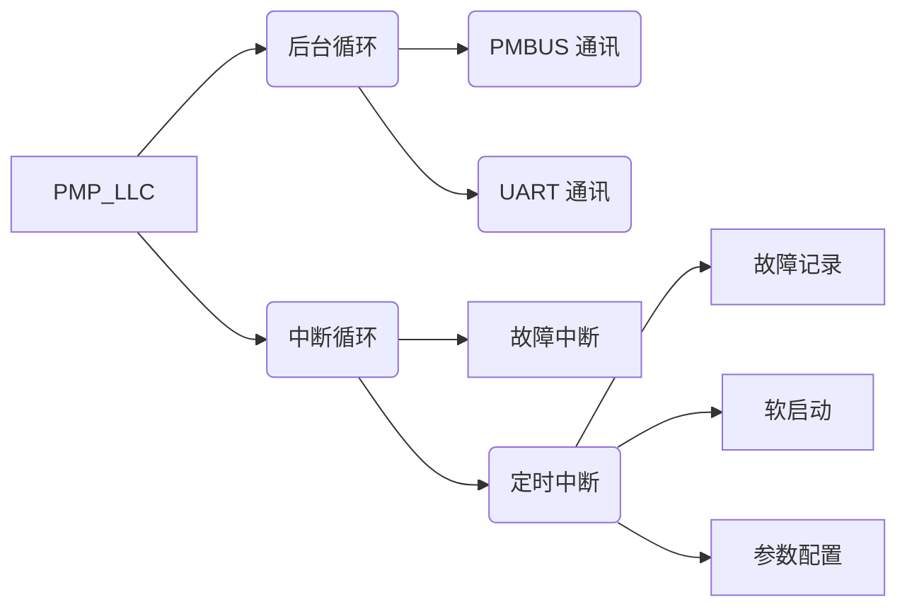

> 软件结构概述

# 1. 流程框架

## 1.1 软件结构

![[1. 软件结构.png]]
* **后台循环：**
    * 系统初始化后，进入循环处理非时间关键型任务——PMBus通信、故障记录等
    * 同时定时器产生固定频率中断跳转中断处理程序
* **中断循环：**
    * 处理时间关键型任务——ADC测量、状态机跳转、系统保护等
    * 电源上电时，监视VIN，进行软启动，直至VIN线性增加至设定点
    * 状态切换，进入调节模式，直至故障发生或命令关闭
>  <mark style="background: #FFF3A3A6;">故障保护由初始设置的硬件实现</mark>

![[2. 状态转换.png]]

# 2. 项目文件

## 2.1 CMD和load文件

## 2.2 中断

## 2.3 PMBus

## 2.4 DPP

## 2.5 故障保护

# 3. 重构

## 3.1 准则

> 低耦合，高内聚

## 3.2 文件层次

## 3.3 变量

## 3.4 函数封装

